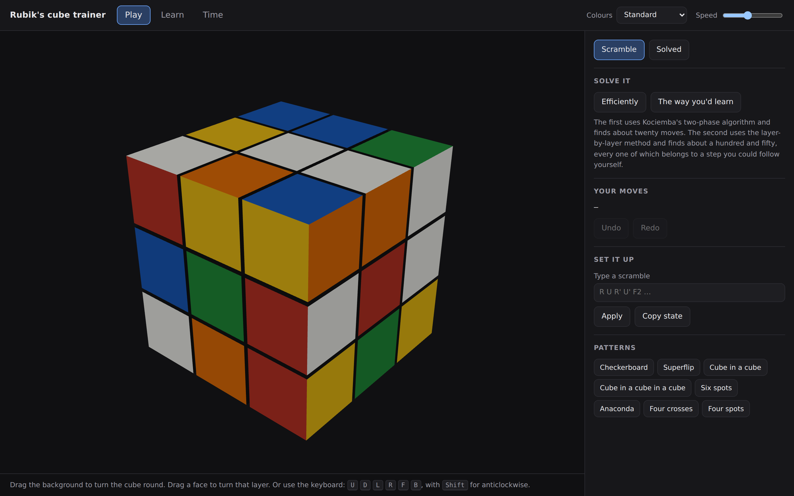
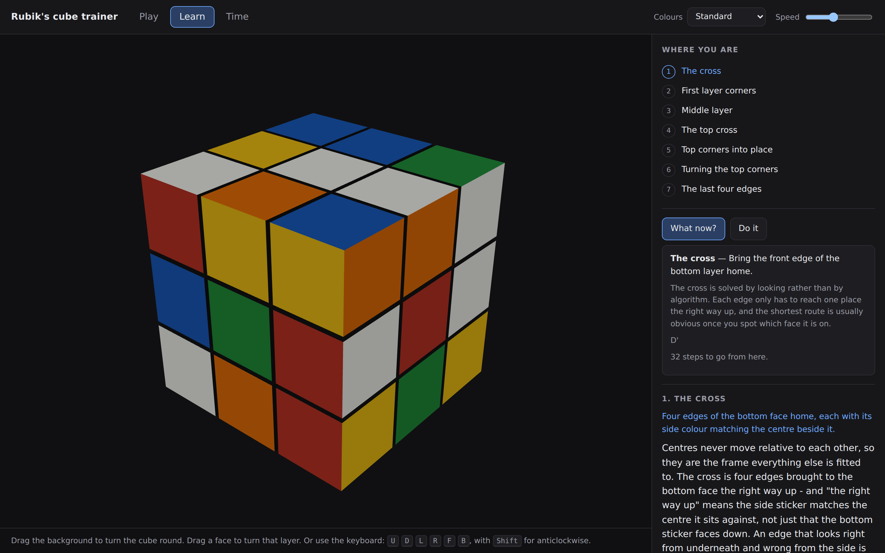

# rubiks-cube-trainer

An interactive 3D Rubik's cube that solves itself two different ways, and teaches you to do
it yourself.



The two solvers are the point. One finds about **21 moves in 40 milliseconds** and is
completely useless as an explanation. The other finds about **150 moves** and every one of
them belongs to a step a person can follow with a cube in their hands. Neither is a
substitute for the other, so both ship.

**[Open it](https://thegolfercoder.github.io/rubiks-cube-trainer/)** — no install, nothing
to sign up for, nothing leaves your machine.

---

## What it does

**Play.** Drag a face to turn that layer, drag the background to spin the cube, or use the
keyboard (`U D L R F B`, with `Shift` for anticlockwise). Scramble, undo, redo, type in a
scramble you have on a physical cube, or paste a 54-character facelet string. Eight named
patterns, including the superflip.

**Learn.** Seven lessons, one per stage of the layer-by-layer method, each with the idea
behind it rather than only the moves — what to look for, where it usually goes wrong, and
why each algorithm does what it does. A progress ladder shows which stages the cube in front
of you has reached. *What now?* gives a hint naming the stage, the algorithm and the reason.
*Practise this stage* sets the cube up with everything before it already done, so the only
thing in front of you is the case you are learning.



**Time.** A competition-rules timer: 15 seconds of inspection, `+2` for starting late, DNF
past 17 seconds. Session statistics use the WCA average — best and worst dropped, the middle
three meaned — because that is the figure competitions rank by and a plain mean is not.
Everything is kept in local storage.

---

## The two solvers

### Kociemba's two-phase algorithm — about 21 moves

Solving a cube directly is a search over 43 quintillion states with no useful heuristic. The
two-phase algorithm changes the target instead.

**Phase 1** takes the cube into the subgroup ⟨U, D, R2, L2, F2, B2⟩: every corner oriented,
every edge oriented, the four middle-slice edges somewhere in the middle slice. Only three
coordinates have to be tracked — 2187 × 2048 × 495 — and a breadth-first table over pairs of
them gives a lower bound that prunes the search hard.

**Phase 2** finishes using only the ten moves that stay inside that subgroup, so nothing
phase 1 achieved is undone.

The first solution found is around 25 moves. The algorithm gets shorter by *not stopping*: a
longer phase-1 manoeuvre often leaves a much easier phase 2, so the search keeps going
through phase-1 solutions of increasing length and keeps the best total. Twenty to
twenty-three moves is typical within a second.

It is not optimal. Every cube can be solved in 20 moves — proved in 2010 with several weeks
of Google's CPU time — and a solver that guarantees it needs far larger tables than belong
in a web page.

### The layer-by-layer method — about 150 moves

Seven stages, in the order every beginner tutorial teaches them:

| | Stage | How it is solved here |
|---|---|---|
| 1 | The cross | Breadth-first search, one edge at a time, keeping the placed ones placed |
| 2 | First layer corners | Repeat `R U R' U'` from the corner's own slot |
| 3 | Middle layer | The right- and left-hand inserts |
| 4 | The top cross | `F R U R' U' F'` |
| 5 | **Permute** the top corners | The corner three-cycle, plus a T-perm for the odd cases |
| 6 | **Orient** the top corners | `R' D' R D`, repeated |
| 7 | The last four edges | The Ua and Ub perms |

**Five before six, not six before five.** The corner three-cycle used in step 5 twists the
corners it moves, so turning them the right way up first would immediately undo the work.
That ordering is the whole reason the beginner method uses the awkward-looking `R' D' R D`
in step 6 rather than a Sune: it leaves the corner *positions* alone. There is a test
pinning it.

Step 6 is the one where beginners give up. It wrecks the bottom layer while it works and
puts it back on its own by the last corner — not by luck: the sequence returns to where it
started after six repeats, each corner needs two or four, and the three laws force the total
to be a multiple of six.

Stages 2 to 7 work by searching over a small set of named manoeuvres — an alignment turn of
U followed by one of the taught algorithms — and keeping the first that makes progress. That
is what a person does when they look at the cube, decide which case they have, and pick the
matching algorithm. It is also far more robust than hand-coding forty case recognitions, and
the annotation still names the algorithm used.

---

## The part most likely to be wrong

Twenty-four arrays describe the geometry of a cube. One wrong entry gives something that
looks entirely plausible in a renderer and is quietly unsolvable, and no amount of staring at
the arrays finds it. So the tests check the **group structure** instead:

- every quarter turn has order four
- opposite faces commute and adjacent ones do not
- the sexy move `R U R' U'` has order six, and so does the Sune
- a T-perm is its own inverse
- **the superflip** — a specific 20-move sequence — flips all twelve edges in place and moves
  nothing else
- any random sequence followed by its inverse returns to solved
- every reachable state satisfies the three laws: total twist a multiple of three, total flip
  even, corner and edge permutation parity equal

Passing the superflip test by accident with wrong tables is not a thing that happens.

The sticker geometry gets the same treatment. A face read in the wrong order looks fine on a
solved cube and mirrors itself the moment anything moves, so it is checked by agreement: a
corner's three stickers must land on the same cubie, an edge's two likewise, and the 54
stickers must distribute over 26 cubies as 8 threes, 12 twos and 6 ones.

---

## Bugs the tests found

Worth listing, because they are the ones that would otherwise have shipped.

**The two-phase time limit only applied once a solution existed.** The superflip ran for
eight minutes instead of the two seconds it was given.

**The phase-2 move budget came from the *target* length.** Asking for a 19-move solution on a
cube needing 22 produced no answer at all rather than a 22-move one. A goal you might miss and
a limit you must not exceed turn out to be different numbers, and the defaults now guarantee a
first solution exists inside the search bounds.

**Following hints one at a time ran forever.** A hint could land in the middle of the
corner-turning stage, which deliberately leaves the cube in pieces; the next hint went back to
fixing what that step had broken, whose fix broke it again. The three last-layer stages are
now marked as groups that have to be done together.

**Sending `U` to the page did not mean `U'`.** A browser test bug rather than an application
one — Playwright needs the modifier named explicitly — but it is the kind of thing that makes
a test suite quietly assert nothing.

---

## Running it

```bash
git clone https://github.com/thegolfercoder/rubiks-cube-trainer
cd rubiks-cube-trainer
npm install

npm run dev        # the app, at localhost:5173
npm test           # 136 tests, including 15 that drive a real browser
npm run build      # a static site in dist/
```

The browser tests need a Chromium. `npx playwright install chromium` fetches one, or set
`PLAYWRIGHT_CHROMIUM_PATH` to point at one you already have.

```
src/
├── core/          the cube, notation, coordinates and lookup tables
│   ├── cube.ts        cubie-level state; the 24 arrays everything rests on
│   ├── moves.ts       notation, parsing, cancellation
│   ├── coords.ts      cube states as small integers, for the search
│   └── tables.ts      move and pruning tables, built once and cached
├── solvers/
│   ├── twoPhase.ts    Kociemba's algorithm
│   └── beginner.ts    the layer-by-layer method, with annotations
├── teach/
│   ├── lessons.ts     the curriculum, as data
│   └── practice.ts    drills and hints
└── ui/                Three.js scene, timer, statistics, the application
```

`src/core` and `src/solvers` have no DOM in them at all: they run in Node, which is why the
solver tests can put a hundred cubes through the two-phase search without a browser.

---

## What it does not do

- **No slice or rotation moves.** `M`, `E`, `S`, `x`, `y`, `z` are not in the notation and a
  drag on a middle layer says so rather than doing something surprising. The centres never
  move, which makes some published patterns — the classic `M2 E2 S2` checkerboard among them —
  impossible here.
- **No CFOP.** The method taught is the beginner one. F2L, full OLL and full PLL are a
  different repository.
- **Not an optimal solver.** See above.
- **No camera input.** Reading a physical cube from a photograph is a real project and this is
  not it. You can type a scramble or a facelet string instead.
- **Only 3×3×3.**

## Licence

MIT — see [LICENSE](LICENSE).
