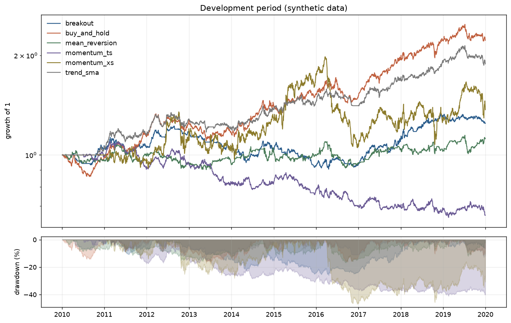
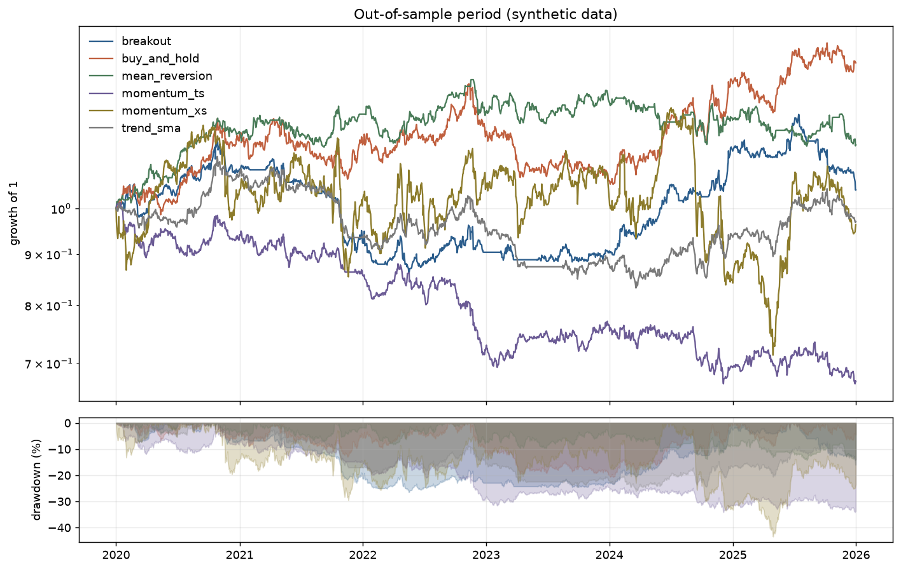

# Results

<!-- Generated by scripts/run_research.py. Do not edit by hand. -->

Generated 2026-09-07 from `data/sample`, 2010-01-04 to 2019-12-31.

> **These runs are on synthetic data.** The series were generated with a known
> drift, volatility and return autocorrelation, so a strategy doing well here has
> demonstrated that the code works and nothing else. See `data/README.md`.

## Development period

The period you are allowed to iterate on. Nothing here is evidence.

| strategy       | cagr   | annualised_volatility | sharpe_ratio | sortino_ratio | max_drawdown | calmar_ratio | win_rate | profit_factor | trades  | exposure | annualised_turnover | probabilistic_sharpe_ratio |
| -------------- | ------ | --------------------- | ------------ | ------------- | ------------ | ------------ | -------- | ------------- | ------- | -------- | ------------------- | -------------------------- |
| breakout       |  0.023 |                 0.083 |        0.305 |         0.432 |       -0.260 |        0.088 |    0.376 |         1.254 | 101.000 |    0.870 |               7.107 |                      0.834 |
| buy_and_hold   |  0.083 |                 0.108 |        0.770 |         1.122 |       -0.172 |        0.484 |    1.000 |           n/a |   4.000 |    1.000 |               0.270 |                      0.993 |
| mean_reversion |  0.011 |                 0.086 |        0.168 |         0.239 |       -0.168 |        0.066 |    0.634 |         1.068 | 358.000 |    0.798 |              24.604 |                      0.704 |
| momentum_ts    | -0.043 |                 0.089 |       -0.434 |        -0.596 |       -0.411 |       -0.105 |    0.289 |         0.779 | 395.000 |    0.991 |              26.447 |                      0.087 |
| momentum_xs    |  0.037 |                 0.225 |        0.269 |         0.380 |       -0.469 |        0.079 |    0.447 |         1.204 | 141.000 |    1.000 |              30.551 |                      0.793 |
| trend_sma      |  0.071 |                 0.096 |        0.742 |         1.071 |       -0.128 |        0.557 |    0.460 |         1.769 | 100.000 |    0.967 |               6.842 |                      0.989 |

## Out-of-sample period

One evaluation, after the development work was finished.

| strategy       | cagr   | annualised_volatility | sharpe_ratio | sortino_ratio | max_drawdown | calmar_ratio | win_rate | profit_factor | trades  | exposure | annualised_turnover | probabilistic_sharpe_ratio |
| -------------- | ------ | --------------------- | ------------ | ------------- | ------------ | ------------ | -------- | ------------- | ------- | -------- | ------------------- | -------------------------- |
| breakout       |  0.007 |                 0.093 |        0.120 |         0.167 |       -0.265 |        0.027 |    0.393 |         1.067 |  56.000 |    0.863 |               6.311 |                      0.617 |
| buy_and_hold   |  0.058 |                 0.114 |        0.531 |         0.771 |       -0.207 |        0.278 |    1.000 |           n/a |   4.000 |    0.999 |               0.271 |                      0.907 |
| mean_reversion |  0.025 |                 0.087 |        0.313 |         0.451 |       -0.142 |        0.173 |    0.618 |         1.101 | 228.000 |    0.823 |              25.636 |                      0.782 |
| momentum_ts    | -0.064 |                 0.093 |       -0.641 |        -0.852 |       -0.341 |       -0.188 |    0.287 |         0.709 | 293.000 |    0.985 |              28.652 |                      0.054 |
| momentum_xs    | -0.006 |                 0.224 |        0.086 |         0.116 |       -0.434 |       -0.014 |    0.597 |         0.872 |  77.000 |    0.999 |              24.626 |                      0.584 |
| trend_sma      | -0.005 |                 0.092 |       -0.007 |        -0.010 |       -0.261 |       -0.019 |    0.372 |         1.003 |  78.000 |    0.934 |               8.037 |                      0.493 |

### Deflated for multiple testing

The best out-of-sample Sharpe belongs to `buy_and_hold` at 0.53, with a standard error of 0.40.

Across the 6 configs the Sharpe ratios have a standard deviation of 0.40. Deflating the best one for having been chosen as the best of 6 gives a probability of **51.5%** that its true Sharpe ratio is above zero.

That count of trials is a floor, not a total. It counts the configs in this
repository and not the variants tried and discarded while writing them, which is
why `docs/METHODOLOGY.md` records those separately.

## Sensitivity to cost assumptions

CAGR over the full sample under three cost models. Slippage is an assumption,
not a measurement, so the question is not what the base case says but whether
anything survives the pessimistic one.

| strategy       | zero cost | base   | pessimistic |
| -------------- | --------- | ------ | ----------- |
| breakout       |     0.021 |  0.017 |      -0.003 |
| buy_and_hold   |     0.074 |  0.074 |       0.073 |
| mean_reversion |     0.030 |  0.016 |      -0.048 |
| momentum_ts    |    -0.036 | -0.051 |      -0.120 |
| momentum_xs    |     0.040 |  0.020 |      -0.055 |
| trend_sma      |     0.045 |  0.041 |       0.021 |

## Walk-forward

`trend_sma` scored fold by fold, three years of run-up to one year of
measurement, rolling forward. The rule has no fitted parameters, so this measures
how stable it is across regimes rather than the value of refitting.

| fold | test start | test end   | CAGR   | Sharpe | max drawdown |
| ---- | ---------- | ---------- | ------ | ------ | ------------ |
| 0    | 2012-11-27 | 2013-11-13 |  0.006 |  0.113 |       -0.088 |
| 1    | 2013-11-14 | 2014-10-31 |  0.071 |  0.720 |       -0.064 |
| 2    | 2014-11-03 | 2015-10-20 |  0.118 |  1.068 |       -0.068 |
| 3    | 2015-10-21 | 2016-10-06 |  0.015 |  0.210 |       -0.068 |
| 4    | 2016-10-07 | 2017-09-25 |  0.074 |  0.814 |       -0.072 |
| 5    | 2017-09-26 | 2018-09-12 |  0.158 |  1.453 |       -0.040 |
| 6    | 2018-09-13 | 2019-08-30 |  0.087 |  0.900 |       -0.085 |
| 7    | 2019-09-02 | 2020-08-18 | -0.072 | -0.735 |       -0.107 |
| 8    | 2020-08-19 | 2021-08-05 |  0.064 |  0.650 |       -0.080 |
| 9    | 2021-08-06 | 2022-07-25 | -0.096 | -1.106 |       -0.138 |
| 10   | 2022-07-26 | 2023-07-12 | -0.087 | -1.041 |       -0.153 |
| 11   | 2023-07-13 | 2024-06-28 |  0.028 |  0.365 |       -0.073 |
| 12   | 2024-07-01 | 2025-06-17 |  0.079 |  0.720 |       -0.089 |

Fold Sharpe ratios: mean 0.32, standard deviation 0.81, 10 of 13 positive.

## Charts

