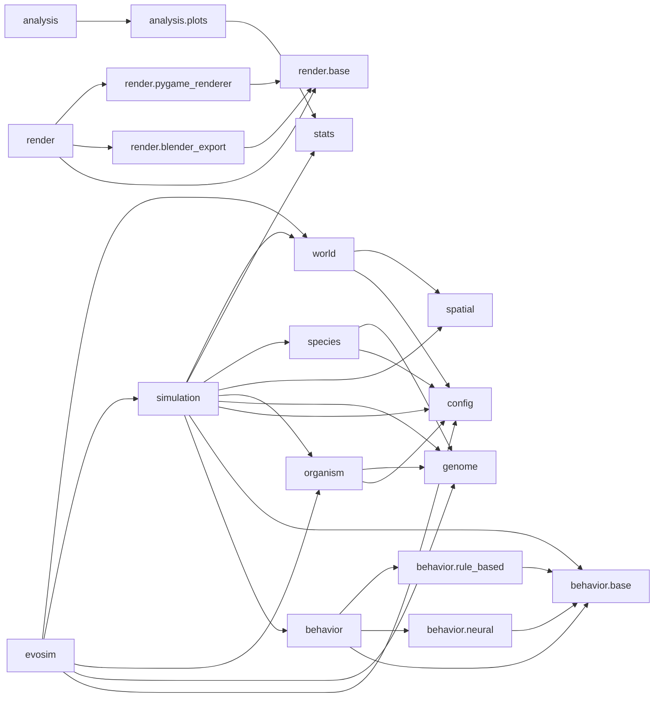

# EvoSim — Project Map

Open **Graph view** to see the whole system. Start here:

## Engine core
- [[evosim]] — package entry
- [[evosim.simulation]] — perceive → decide → act → live
- [[evosim.organism]] · [[evosim.genome]] · [[evosim.world]] · [[evosim.species]] · [[evosim.spatial]] · [[evosim.config]] · [[evosim.stats]]

## Brains (pluggable)
- [[evosim.behavior]] — [[evosim.behavior.base]] · [[evosim.behavior.rule_based]] · [[evosim.behavior.neural]]

## Visualization & analysis
- [[evosim.render]] · [[evosim.analysis]]

## Entry points
- [[scripts.run_simulation]] · [[scripts.run_headless]] · [[scripts.capture_animation]] · [[scripts.export_blender]]
- [[scripts.build_web]] · [[scripts.build_single]] · [[scripts.build_mindmap]]

## Browser layer
- [[web.survival (page)]] · [[web.index (page)]] · [[web.evosim_pkg]] · [[dist (single files)]]

## Tests
- [[tests.test_simulation]] · [[tests.test_genome]] · [[tests.test_world]] · [[tests.test_analysis]]

## Engine dependency graph

